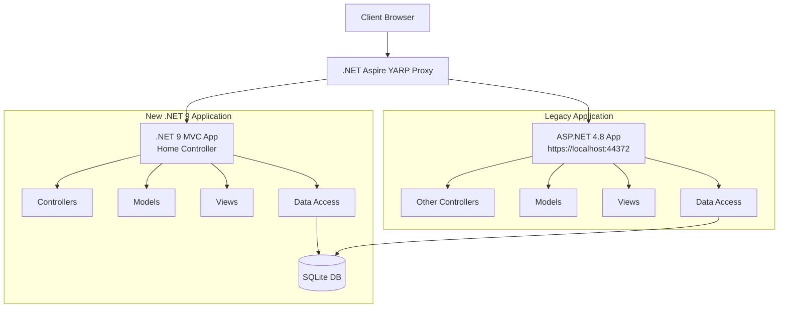

# Migration Plan: ASP.NET 4.8 to .NET 9 with Aspire and YARP Proxy

Based on my analysis of the existing ASP.NET 4.8 application, I've created a detailed plan to migrate the Home controller and its views to a new .NET 9 MVC application, with an Aspire project using YARP as a reverse proxy.

## Executive Summary

This document provides a step-by-step plan for migrating the Home controller and its related views from an ASP.NET 4.8 MVC application to a new .NET 9 MVC application. The migration will use .NET Aspire with YARP as a reverse proxy to route requests between the legacy and new applications.

**Key Components to Migrate:**
- HomeController with 5 action methods (Index, About, Contact, _FeaturedEvents, _Stats, _UpcomingEvents)
- 3 main views (Index, About, Contact)
- 3 partial views (_FeaturedEvents, _Stats, _UpcomingEvents)
- Related models (Event, Registration, StatItem)
- Repository interfaces and implementations

## Current Application Analysis

The HomeController in the existing application:
- Displays a home page with featured events, statistics, and user-specific upcoming events
- Has About and Contact pages
- Uses Dapper for direct SQL queries to a SQLite database
- Depends on the IEventRepository interface but also uses direct database access in some methods
- Uses partial views (_FeaturedEvents, _Stats, _UpcomingEvents) to organize the UI

## Migration Architecture



## Migration Plan

### 1. Project Setup

1. **Create .NET 9 MVC Project**:
   - Create a new ASP.NET Core MVC project targeting .NET 9
   ```bash
   dotnet new mvc -n EventManagementSystemv2 -o src/EventManagementSystemv2 --framework net9.0
   ```
   - Set up folder structure for controllers, views, models, and data access
   ```
   src/EventManagementSystemv2/
   ├── Controllers/
   │   └── HomeController.cs
   ├── Models/
   │   ├── EventModels.cs
   │   └── StatsModel.cs
   ├── Views/
   │   ├── Home/
   │   │   ├── Index.cshtml
   │   │   ├── About.cshtml
   │   │   ├── Contact.cshtml
   │   │   ├── _FeaturedEvents.cshtml
   │   │   ├── _Stats.cshtml
   │   │   └── _UpcomingEvents.cshtml
   │   └── Shared/
   │       └── _Layout.cshtml
   ├── Data/
   │   ├── ApplicationDbContext.cs
   │   └── DatabaseConfig.cs
   └── Repositories/
       ├── Interfaces/
       │   └── IEventRepository.cs
       └── EventRepository.cs
   ```

2. **Create .NET Aspire Project with YARP**:
   - Create a new Aspire project
   ```bash
   dotnet new aspire-starter -n EMSProxy -o src/EMSProxy
   ```
   - Add YARP package
   ```bash
   cd src/EMSProxy
   dotnet add package Yarp.ReverseProxy
   ```
   - Configure YARP as a reverse proxy
   - Set up routing rules to direct Home controller requests to the new app and others to the legacy app

### 2. Data Access Layer Migration

1. **Create Entity Models**:
   - Migrate `Event`, `Registration`, and `StatItem` models to .NET 9 compatible classes
   - Use data annotations for validation and EF Core mapping
   - Create the following files:
     - `Models/EventModels.cs`
     - `Models/StatsModel.cs`

2. **Create DbContext**:
   - Create an EF Core DbContext for the SQLite database in `Data/ApplicationDbContext.cs`
   - Define entity configurations
   - Configure the connection string in `appsettings.json`:
   ```json
   {
     "ConnectionStrings": {
       "DefaultConnection": "Data Source=../EventRegistrationSystem/EventRegistration.db"
     }
   }
   ```
   - Register the DbContext in `Program.cs`:
   ```csharp
   builder.Services.AddDbContext<ApplicationDbContext>(options =>
       options.UseSqlite(builder.Configuration.GetConnectionString("DefaultConnection")));
   ```

3. **Repository Implementation**:
   - Create repository interfaces based on the existing ones in `Repositories/Interfaces/`
   - Implement repositories using EF Core instead of Dapper in `Repositories/`
   - Focus on the methods needed by the HomeController
   - Register repositories in DI container:
   ```csharp
   builder.Services.AddScoped<IEventRepository, EventRepository>();
   ```

```csharp
// Models/EventModels.cs
using System;
using System.ComponentModel.DataAnnotations;
using System.ComponentModel.DataAnnotations.Schema;

namespace EventManagementSystemv2.Models
{
    public class Event
    {
        public int EventId { get; set; }
        
        [Required]
        public string Name { get; set; } = string.Empty;
        
        public string Description { get; set; } = string.Empty;
        
        [Required]
        public DateTime EventDate { get; set; }
        
        public string Location { get; set; } = string.Empty;
        
        public int MaxAttendees { get; set; }
        
        public string CreatedBy { get; set; } = string.Empty;
        
        public DateTime CreatedDate { get; set; }
        
        // Navigation property
        [NotMapped]
        public int RegistrationCount { get; set; }
    }

    public class Registration
    {
        public int RegistrationId { get; set; }
        
        public int EventId { get; set; }
        
        public string UserId { get; set; } = string.Empty;
        
        public DateTime RegistrationDate { get; set; }

        // Navigation properties
        [NotMapped]
        public string UserName { get; set; } = string.Empty;
        
        [NotMapped]
        public Event? Event { get; set; }
    }
}

// Models/StatsModel.cs
namespace EventManagementSystemv2.Models
{
    public class StatItem
    {
        public string StatLabel { get; set; } = string.Empty;
        public int StatValue { get; set; }
    }
}

// Data/ApplicationDbContext.cs
using Microsoft.EntityFrameworkCore;
using EventManagementSystemv2.Models;

namespace EventManagementSystemv2.Data
{
    public class ApplicationDbContext : DbContext
    {
        public ApplicationDbContext(DbContextOptions<ApplicationDbContext> options)
            : base(options)
        {
        }

        public DbSet<Event> Events { get; set; }
        public DbSet<Registration> Registrations { get; set; }

        protected override void OnModelCreating(ModelBuilder modelBuilder)
        {
            base.OnModelCreating(modelBuilder);

            // Configure Event entity
            modelBuilder.Entity<Event>(entity =>
            {
                entity.ToTable("Events");
                entity.HasKey(e => e.EventId);
                entity.Property(e => e.EventDate).HasColumnType("TEXT"); // SQLite date format
            });

            // Configure Registration entity
            modelBuilder.Entity<Registration>(entity =>
            {
                entity.ToTable("Registrations");
                entity.HasKey(r => r.RegistrationId);
            });
        }
    }
}
```

```csharp
// Repositories/Interfaces/IEventRepository.cs
using System.Collections.Generic;
using System.Threading.Tasks;
using EventManagementSystemv2.Models;

namespace EventManagementSystemv2.Repositories.Interfaces
{
    public interface IEventRepository
    {
        Task<IEnumerable<Event>> GetAllEventsAsync();
        Task<Event?> GetEventByIdAsync(int eventId);
        Task<IEnumerable<Event>> GetEventsByCreatorAsync(string userId);
        Task<IEnumerable<Event>> GetFeaturedEventsAsync(int count = 3);
        Task<int> CreateEventAsync(Event eventEntity);
        Task<bool> UpdateEventAsync(Event eventEntity);
        Task<bool> DeleteEventAsync(int eventId);
        Task<int> GetRegistrationCountAsync(int eventId);
        Task<IEnumerable<dynamic>> GetStatsAsync();
        Task<IEnumerable<Registration>> GetUpcomingUserEventsAsync(string userName);
    }
}

// Repositories/EventRepository.cs
using System;
using System.Collections.Generic;
using System.Linq;
using System.Threading.Tasks;
using Microsoft.EntityFrameworkCore;
using EventManagementSystemv2.Data;
using EventManagementSystemv2.Models;
using EventManagementSystemv2.Repositories.Interfaces;

namespace EventManagementSystemv2.Repositories
{
    public class EventRepository : IEventRepository
    {
        private readonly ApplicationDbContext _context;

        public EventRepository(ApplicationDbContext context)
        {
            _context = context;
        }

        public async Task<IEnumerable<Event>> GetAllEventsAsync()
        {
            return await _context.Events
                .OrderByDescending(e => e.EventDate)
                .ToListAsync();
        }

        public async Task<Event?> GetEventByIdAsync(int eventId)
        {
            return await _context.Events.FindAsync(eventId);
        }

        public async Task<IEnumerable<Event>> GetEventsByCreatorAsync(string userId)
        {
            return await _context.Events
                .Where(e => e.CreatedBy == userId)
                .OrderByDescending(e => e.EventDate)
                .ToListAsync();
        }

        public async Task<IEnumerable<Event>> GetFeaturedEventsAsync(int count = 3)
        {
            // This replicates the SQL query in the original HomeController
            var events = await _context.Events
                .OrderBy(e => e.EventDate)
                .Take(count)
                .ToListAsync();

            // Load registration counts
            foreach (var eventItem in events)
            {
                eventItem.RegistrationCount = await _context.Registrations
                    .CountAsync(r => r.EventId == eventItem.EventId);
            }

            return events;
        }

        public async Task<int> CreateEventAsync(Event eventEntity)
        {
            eventEntity.CreatedDate = DateTime.Now;
            _context.Events.Add(eventEntity);
            await _context.SaveChangesAsync();
            return eventEntity.EventId;
        }

        public async Task<bool> UpdateEventAsync(Event eventEntity)
        {
            _context.Events.Update(eventEntity);
            var result = await _context.SaveChangesAsync();
            return result > 0;
        }

        public async Task<bool> DeleteEventAsync(int eventId)
        {
            // First delete registrations
            var registrations = await _context.Registrations
                .Where(r => r.EventId == eventId)
                .ToListAsync();
            
            _context.Registrations.RemoveRange(registrations);
            
            // Then delete the event
            var eventEntity = await _context.Events.FindAsync(eventId);
            if (eventEntity == null)
                return false;
                
            _context.Events.Remove(eventEntity);
            var result = await _context.SaveChangesAsync();
            return result > 0;
        }

        public async Task<int> GetRegistrationCountAsync(int eventId)
        {
            return await _context.Registrations
                .CountAsync(r => r.EventId == eventId);
        }

        public async Task<IEnumerable<dynamic>> GetStatsAsync()
        {
            // This replicates the SQL query in the original HomeController
            var now = DateTime.Now;
            var nextWeek = now.AddDays(7);
            
            var activeEvents = await _context.Events
                .CountAsync(e => e.EventDate > now);
                
            var thisWeeksEvents = await _context.Events
                .CountAsync(e => e.EventDate > now && e.EventDate <= nextWeek);
                
            var registeredUsers = await _context.Registrations
                .Include(r => r.Event)
                .CountAsync(r => r.Event != null && r.Event.EventDate > now);
                
            var stats = new List<dynamic>
            {
                new { StatLabel = "ActiveEvents", StatValue = activeEvents },
                new { StatLabel = "ThisWeeksEvents", StatValue = thisWeeksEvents },
                new { StatLabel = "RegisteredUsers", StatValue = registeredUsers }
            };
            
            return stats;
        }

        public async Task<IEnumerable<Registration>> GetUpcomingUserEventsAsync(string userName)
        {
            var now = DateTime.Now;
            var nextWeek = now.AddDays(7);
            
            return await _context.Registrations
                .Include(r => r.Event)
                .Where(r => r.UserName == userName && 
                       r.Event != null && 
                       r.Event.EventDate > now && 
                       r.Event.EventDate <= nextWeek)
                .OrderByDescending(r => r.Event!.EventDate)
                .ToListAsync();
        }
    }
}
```

### 3. HomeController Migration

1. **Create HomeController**:
   - Migrate the HomeController to .NET 9 syntax
   - Update dependency injection
   - Replace direct SQL queries with repository calls
   - Update action methods to use async/await pattern

```csharp
// Controllers/HomeController.cs
using System;
using System.Collections.Generic;
using System.Diagnostics;
using System.Threading.Tasks;
using Microsoft.AspNetCore.Mvc;
using Microsoft.Extensions.Logging;
using EventManagementSystemv2.Models;
using EventManagementSystemv2.Repositories.Interfaces;

namespace EventManagementSystemv2.Controllers
{
    public class HomeController : Controller
    {
        private readonly IEventRepository _eventRepository;
        private readonly ILogger<HomeController> _logger;

        public HomeController(IEventRepository eventRepository, ILogger<HomeController> logger)
        {
            _eventRepository = eventRepository;
            _logger = logger;
        }

        public async Task<IActionResult> Index()
        {
            try
            {
                var featuredEvents = await _eventRepository.GetFeaturedEventsAsync();
                ViewBag.FeaturedEvents = featuredEvents;
                return View();
            }
            catch (Exception ex)
            {
                _logger.LogError(ex, "Error retrieving featured events for home page");
                return View(new List<Event>());
            }
        }

        public IActionResult About()
        {
            return View();
        }

        public IActionResult Contact()
        {
            ViewBag.Message = "Your contact page.";
            return View();
        }

        public async Task<IActionResult> FeaturedEvents()
        {
            try
            {
                var featuredEvents = await _eventRepository.GetFeaturedEventsAsync();
                return PartialView("_FeaturedEvents", featuredEvents);
            }
            catch (Exception ex)
            {
                _logger.LogError(ex, "Error retrieving featured events");
                return PartialView("_FeaturedEvents", new List<Event>());
            }
        }

        public async Task<IActionResult> Stats()
        {
            try
            {
                var stats = await _eventRepository.GetStatsAsync();
                return PartialView("_Stats", stats);
            }
            catch (Exception ex)
            {
                _logger.LogError(ex, "Error retrieving stats");
                return PartialView("_Stats", new List<dynamic>());
            }
        }

        public async Task<IActionResult> UpcomingEvents()
        {
            // If user is not authenticated, return empty result
            if (!User.Identity.IsAuthenticated)
            {
                return PartialView("_UpcomingEvents", new List<Registration>());
            }

            try
            {
                var upcomingEvents = await _eventRepository.GetUpcomingUserEventsAsync(User.Identity.Name);
                return PartialView("_UpcomingEvents", upcomingEvents);
            }
            catch (Exception ex)
            {
                _logger.LogError(ex, "Error retrieving upcoming events");
                return PartialView("_UpcomingEvents", new List<Registration>());
            }
        }

        [ResponseCache(Duration = 0, Location = ResponseCacheLocation.None, NoStore = true)]
        public IActionResult Error()
        {
            return View(new ErrorViewModel { RequestId = Activity.Current?.Id ?? HttpContext.TraceIdentifier });
        }
    }

    public class ErrorViewModel
    {
        public string RequestId { get; set; } = string.Empty;
        public bool ShowRequestId => !string.IsNullOrEmpty(RequestId);
    }
}
```

### 4. View Migration

1. **Layout and Shared Views**:
   - Create a new _Layout.cshtml with Bootstrap 5
   - Update HTML helpers to Tag Helpers
   - Migrate inline styles to CSS files

2. **Home Views**:
   - Migrate Index.cshtml, About.cshtml, and Contact.cshtml
   - Update Razor syntax for .NET 9 compatibility
   - Replace @Html.Action with ViewComponents or Partial Views

3. **Partial Views**:
   - Convert partial views (_FeaturedEvents, _Stats, _UpcomingEvents) to either:
     - Partial Views (simpler approach)
     - ViewComponents (more modern approach with better encapsulation)

```html
<!-- Views/Shared/_Layout.cshtml -->
<!DOCTYPE html>
<html lang="en">
<head>
    <meta charset="utf-8" />
    <meta name="viewport" content="width=device-width, initial-scale=1.0" />
    <title>@ViewData["Title"] - Event System</title>
    <link rel="stylesheet" href="~/lib/bootstrap/dist/css/bootstrap.min.css" />
    <link rel="stylesheet" href="~/css/site.css" asp-append-version="true" />
    <link rel="stylesheet" href="~/EventManagementSystemv2.styles.css" asp-append-version="true" />
    <style>
        .jumbotron {
            padding: 2rem 1rem;
            margin-bottom: 2rem;
            background-color: #e9ecef;
            border-radius: 0.3rem;
        }
        .event-card {
            transition: transform 0.3s;
        }
        .event-card:hover {
            transform: translateY(-5px);
            box-shadow: 0 4px 8px rgba(0,0,0,0.1);
        }
        .stats-container {
            background-color: #f8f9fa;
            border-radius: 0.3rem;
            padding: 1.5rem;
        }
        .stat-item {
            text-align: center;
            padding: 1rem;
        }
        .stat-number {
            font-size: 2.5rem;
            font-weight: bold;
            color: #0d6efd;
        }
        .search-container {
            background-color: #f1f8ff;
            padding: 1.5rem;
            border-radius: 0.3rem;
            margin-bottom: 2rem;
        }
    </style>
</head>
<body>
    <header>
        <nav class="navbar navbar-expand-sm navbar-toggleable-sm navbar-dark bg-primary">
            <div class="container">
                <a class="navbar-brand" asp-controller="Home" asp-action="Index">.NET Events</a>
                <button class="navbar-toggler" type="button" data-bs-toggle="collapse" data-bs-target=".navbar-collapse" 
                        aria-controls="navbarSupportedContent" aria-expanded="false" aria-label="Toggle navigation">
                    <span class="navbar-toggler-icon"></span>
                </button>
                <div class="collapse navbar-collapse d-sm-inline-flex justify-content-between">
                    <ul class="navbar-nav flex-grow-1">
                        <li class="nav-item">
                            <a class="nav-link" asp-controller="Home" asp-action="Index">Home</a>
                        </li>
                        <li class="nav-item">
                            <a class="nav-link" asp-controller="Home" asp-action="About">About</a>
                        </li>
                        <li class="nav-item">
                            <a class="nav-link" asp-controller="Home" asp-action="Contact">Contact</a>
                        </li>
                        <li class="nav-item">
                            <a class="nav-link" asp-controller="Event" asp-action="Index">All Events</a>
                        </li>
                        @if (User.Identity.IsAuthenticated)
                        {
                            <li class="nav-item">
                                <a class="nav-link" asp-controller="Event" asp-action="MyEvents">My Events</a>
                            </li>
                            <li class="nav-item">
                                <a class="nav-link" asp-controller="Event" asp-action="MyRegistrations">My Registrations</a>
                            </li>
                            @if (User.IsInRole("Admin"))
                            {
                                <li class="nav-item">
                                    <a class="nav-link" asp-controller="Admin" asp-action="Users">Admin</a>
                                </li>
                            }
                        }
                    </ul>
                    <partial name="_LoginPartial" />
                </div>
            </div>
        </nav>
    </header>
    <div class="container body-content">
        @RenderBody()
        <hr />
        <footer>
            <p>&copy; @DateTime.Now.Year - .NET Events</p>
        </footer>
    </div>
    <script src="~/lib/jquery/dist/jquery.min.js"></script>
    <script src="~/lib/bootstrap/dist/js/bootstrap.bundle.min.js"></script>
    <script src="~/js/site.js" asp-append-version="true"></script>
    @await RenderSectionAsync("Scripts", required: false)
</body>
</html>
```

```html
<!-- Views/Home/Index.cshtml -->
@{
    ViewData["Title"] = "Home Page";
}

<main>
    <!-- Hero Section -->
    <div class="jumbotron">
        <div class="container">
            <div class="row align-items-center">
                <div class="col-md">
                    <h1 class="display-4">Find events or create your own</h1>
                    <p class="lead">
                        An easy-to-use platform to discover local events and manage registrations.
                        Perfect for both event organizers and attendees.
                    </p>
                    <div class="mt-4">
                        <a asp-controller="Event" asp-action="Index" class="btn btn-primary btn-lg me-2">Browse Events</a>
                        <a asp-controller="Event" asp-action="Create" class="btn btn-success btn-lg me-2">Create Event</a>
                    </div>
                </div>
            </div>
        </div>
    </div>

    <!-- Stats Section -->
    <vc:stats></vc:stats>

    <!-- Featured Events Section -->
    <vc:featured-events></vc:featured-events>

    <!-- Upcoming Events - User-specific content (show when logged in) -->
    @if (User.Identity.IsAuthenticated)
    {
        <vc:upcoming-events></vc:upcoming-events>
    }
</main>
```

```html
<!-- Views/Home/About.cshtml -->
@{
    ViewData["Title"] = "About";
}
<main aria-labelledby="title">
    <h2 id="title">@ViewData["Title"]</h2>
    <h3>@ViewBag.Message</h3>

    <p>Use this area to provide additional information.</p>
</main>
```

```html
<!-- Views/Home/Contact.cshtml -->
@{
    ViewData["Title"] = "Contact";
}
<main aria-labelledby="title">
    <h2 id="title">@ViewData["Title"]</h2>
    <h3>@ViewBag.Message</h3>

    <address>
        One Microsoft Way<br />
        Redmond, WA 98052-6399<br />
        <abbr title="Phone">P:</abbr>
        425.555.0100
    </address>

    <address>
        <strong>Support:</strong>   <a href="mailto:Support@example.com">Support@example.com</a><br />
        <strong>Marketing:</strong> <a href="mailto:Marketing@example.com">Marketing@example.com</a>
    </address>
</main>
```

```html
<!-- Views/Home/_FeaturedEvents.cshtml -->
@model IEnumerable<EventManagementSystemv2.Models.Event>

<div class="container mb-5">
    <h2 class="mb-4">Upcoming Events</h2>
    <div class="row row-cols-1 row-cols-md-3 g-4">
        @foreach (var eventItem in Model)
        {
            <div class="col">
                <div class="card h-100 event-card">
                    <div class="card-body">
                        <h5 class="card-title">@eventItem.Name</h5>
                        <p class="card-text">@eventItem.Description</p>
                    </div>
                    <div class="card-footer bg-transparent">
                        <div class="d-flex justify-content-between align-items-center">
                            <small class="text-muted">@eventItem.EventDate.ToString("MMMM d, yyyy")</small>
                            <small class="text-muted">@eventItem.RegistrationCount/@eventItem.MaxAttendees spots</small>
                        </div>
                        <a asp-controller="Event" asp-action="Details" asp-route-id="@eventItem.EventId" 
                           class="btn btn-outline-primary mt-2 w-100">View Details</a>
                    </div>
                </div>
            </div>
        }
    </div>
    <div class="text-center mt-4">
        <a asp-controller="Event" asp-action="Index" class="btn btn-outline-primary">View All Events</a>
    </div>
</div>
```

```html
<!-- Views/Home/_Stats.cshtml -->
@model IEnumerable<dynamic>

<div class="container mb-5">
    <div class="stats-container">
        <div class="row">
            @foreach (var stat in Model)
            {
                <div class="col-md-4 stat-item">
                    <div class="stat-number">@stat.StatValue</div>
                    @if (stat.StatLabel == "ActiveEvents")
                    {
                        <div>Active Events</div>
                    }
                    else if (stat.StatLabel == "RegisteredUsers")
                    {
                        <div>Registered Users</div>
                    }
                    else if (stat.StatLabel == "ThisWeeksEvents")
                    {
                        <div>Events This Week</div>
                    }
                </div>
            }
        </div>
    </div>
</div>
```

```html
<!-- Views/Home/_UpcomingEvents.cshtml -->
@model IEnumerable<EventManagementSystemv2.Models.Registration>

<div class="container mb-5">
    <div class="card">
        <div class="card-header bg-light">
            <h4 class="mb-0">Your Upcoming Events</h4>
        </div>
        <div class="card-body">
            <div class="table-responsive">
                <table class="table table-hover">
                    <thead>
                        <tr>
                            <th>Event</th>
                            <th>Date</th>
                            <th>Location</th>
                            <th>Actions</th>
                        </tr>
                    </thead>
                    <tbody>
                        @if (Model != null && Model.Any())
                        {
                            foreach (var registration in Model)
                            {
                                <tr>
                                    <td>@registration.Event?.Name</td>
                                    <td>@registration.Event?.EventDate.ToString("MMMM d, yyyy")</td>
                                    <td>@registration.Event?.Location</td>
                                    <td>
                                        <a asp-controller="Event" asp-action="Details" asp-route-id="@registration.EventId" 
                                           class="btn btn-sm btn-outline-primary">View</a>
                                        <a asp-controller="Event" asp-action="CancelRegistration" asp-route-id="@registration.RegistrationId" 
                                           class="btn btn-sm btn-outline-danger">Cancel</a>
                                    </td>
                                </tr>
                            }
                        }
                        else
                        {
                            <tr>
                                <td colspan="4" class="text-center">You have no upcoming events in the next 7 days.</td>
                            </tr>
                        }
                    </tbody>
                </table>
            </div>
        </div>
    </div>
</div>
```

```csharp
// ViewComponents Implementation
// ViewComponents/FeaturedEventsViewComponent.cs
using System.Threading.Tasks;
using Microsoft.AspNetCore.Mvc;
using EventManagementSystemv2.Repositories.Interfaces;

namespace EventManagementSystemv2.ViewComponents
{
    public class FeaturedEventsViewComponent : ViewComponent
    {
        private readonly IEventRepository _eventRepository;

        public FeaturedEventsViewComponent(IEventRepository eventRepository)
        {
            _eventRepository = eventRepository;
        }

        public async Task<IViewComponentResult> InvokeAsync()
        {
            var featuredEvents = await _eventRepository.GetFeaturedEventsAsync();
            return View("_FeaturedEvents", featuredEvents);
        }
    }
}

// ViewComponents/StatsViewComponent.cs
using System.Threading.Tasks;
using Microsoft.AspNetCore.Mvc;
using EventManagementSystemv2.Repositories.Interfaces;

namespace EventManagementSystemv2.ViewComponents
{
    public class StatsViewComponent : ViewComponent
    {
        private readonly IEventRepository _eventRepository;

        public StatsViewComponent(IEventRepository eventRepository)
        {
            _eventRepository = eventRepository;
        }

        public async Task<IViewComponentResult> InvokeAsync()
        {
            var stats = await _eventRepository.GetStatsAsync();
            return View("_Stats", stats);
        }
    }
}

// ViewComponents/UpcomingEventsViewComponent.cs
using System.Threading.Tasks;
using Microsoft.AspNetCore.Mvc;
using EventManagementSystemv2.Repositories.Interfaces;

namespace EventManagementSystemv2.ViewComponents
{
    public class UpcomingEventsViewComponent : ViewComponent
    {
        private readonly IEventRepository _eventRepository;

        public UpcomingEventsViewComponent(IEventRepository eventRepository)
        {
            _eventRepository = eventRepository;
        }

        public async Task<IViewComponentResult> InvokeAsync()
        {
            if (!User.Identity.IsAuthenticated)
            {
                return View("_UpcomingEvents", new List<Registration>());
            }

            var upcomingEvents = await _eventRepository.GetUpcomingUserEventsAsync(User.Identity.Name);
            return View("_UpcomingEvents", upcomingEvents);
        }
    }
}

### 5. YARP Proxy Configuration

1. **Configure Program.cs in Aspire Project**:
   - Set up the YARP reverse proxy in the Aspire project

```csharp
// src/EMSProxy/Program.cs
using Microsoft.AspNetCore.Builder;
using Microsoft.Extensions.DependencyInjection;
using Microsoft.Extensions.Hosting;

var builder = WebApplication.CreateBuilder(args);

// Add YARP reverse proxy
builder.Services.AddReverseProxy()
    .LoadFromConfig(builder.Configuration.GetSection("ReverseProxy"));

// Add services to the container
builder.Services.AddControllers();

var app = builder.Build();

// Configure the HTTP request pipeline
if (app.Environment.IsDevelopment())
{
    app.UseDeveloperExceptionPage();
}

app.UseHttpsRedirection();
app.UseRouting();
app.UseAuthorization();

// Map the reverse proxy routes
app.MapReverseProxy();

app.Run();
```

2. **Configure appsettings.json for YARP**:
   - Set up routing rules to direct Home controller requests to the new app and others to the legacy app

```json
// src/EMSProxy/appsettings.json
{
  "Logging": {
    "LogLevel": {
      "Default": "Information",
      "Microsoft.AspNetCore": "Warning"
    }
  },
  "AllowedHosts": "*",
  "ReverseProxy": {
    "Routes": {
      "home-route": {
        "ClusterId": "new-app",
        "Match": {
          "Path": "/Home/{**catch-all}"
        },
        "Transforms": [
          { "PathPattern": "/Home/{**catch-all}" }
        ]
      },
      "home-root-route": {
        "ClusterId": "new-app",
        "Match": {
          "Path": "/"
        }
      },
      "static-files-route": {
        "ClusterId": "new-app",
        "Match": {
          "Path": "/lib/{**catch-all}"
        },
        "Transforms": [
          { "PathPattern": "/lib/{**catch-all}" }
        ]
      },
      "css-route": {
        "ClusterId": "new-app",
        "Match": {
          "Path": "/css/{**catch-all}"
        },
        "Transforms": [
          { "PathPattern": "/css/{**catch-all}" }
        ]
      },
      "js-route": {
        "ClusterId": "new-app",
        "Match": {
          "Path": "/js/{**catch-all}"
        },
        "Transforms": [
          { "PathPattern": "/js/{**catch-all}" }
        ]
      },
      "legacy-route": {
        "ClusterId": "legacy-app",
        "Match": {
          "Path": "{**catch-all}"
        },
        "Transforms": [
          { "PathPattern": "{**catch-all}" }
        ]
      }
    },
    "Clusters": {
      "new-app": {
        "Destinations": {
          "new-app-1": {
            "Address": "https://localhost:5001"
          }
        }
      },
      "legacy-app": {
        "Destinations": {
          "legacy-app-1": {
            "Address": "https://localhost:44372"
          }
        }
      }
    }
  }
}
```

3. **Configure Authentication Sharing**:
   - To handle authentication between the two applications, we need to share the authentication cookie

```csharp
// src/EventManagementSystemv2/Program.cs (Add to the existing Program.cs)
// Configure authentication to use the same cookie as the legacy app
builder.Services.AddAuthentication("Identity.Application")
    .AddCookie("Identity.Application", options =>
    {
        options.Cookie.Name = ".AspNet.ApplicationCookie"; // Same name as legacy app
        options.Cookie.Domain = "localhost"; // Set to your domain
        options.Cookie.Path = "/";
    });
```

### 6. Testing and Deployment

1. **Start Both Applications**:
   - Start the legacy ASP.NET 4.8 application
   ```bash
   # Run the legacy app using IIS Express
   cd src/EventRegistrationSystem
   start /B iisexpress /path:"$(pwd)" /port:44372
   ```
   
   - Start the new .NET 9 MVC application
   ```bash
   cd src/EventManagementSystemv2
   dotnet run --urls=https://localhost:5001
   ```
   
   - Start the Aspire YARP proxy
   ```bash
   cd src/EMSProxy
   dotnet run --urls=https://localhost:5002
   ```

2. **Test the Integration**:
   - Access the application through the YARP proxy: https://localhost:5002
   - Verify that Home controller requests are routed to the new application
   - Verify that other requests are routed to the legacy application
   - Test authentication works across both applications

3. **Troubleshooting Common Issues**:
   - CORS issues: Configure CORS if needed
   - Authentication issues: Ensure cookie settings match between applications
   - Routing issues: Check YARP route configuration
   - Static file issues: Ensure static file routes are correctly configured
