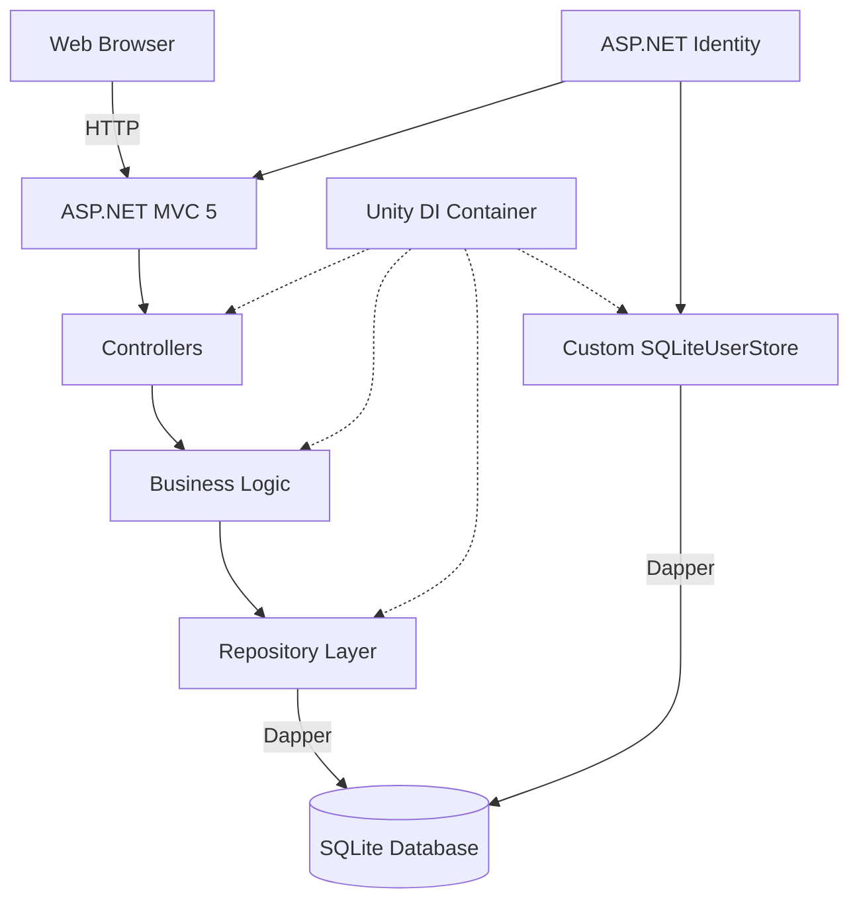
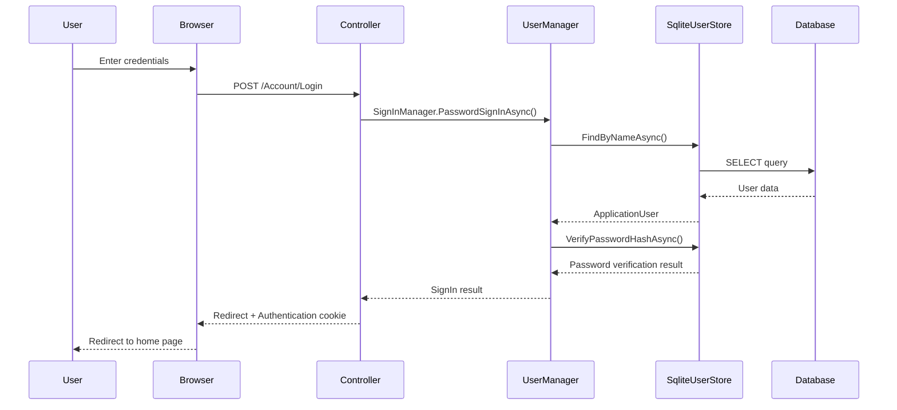
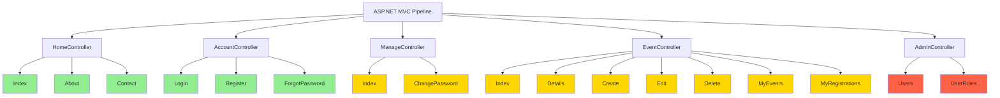
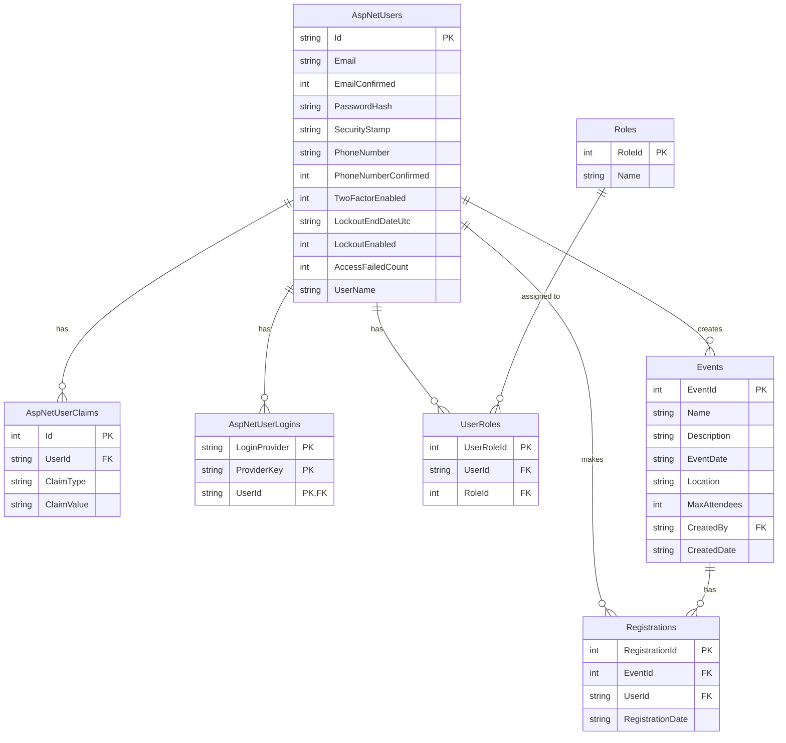

# Event Registration System - Product Requirements Document

## 1. Introduction

### 1.1 Purpose
This document outlines the requirements for an Event Registration System built using .NET Framework 4.8, ASP.NET MVC, Dapper, and SQLite. The system will allow users to create, manage, and register for events with role-based access control.

### 1.2 Scope
The Event Registration System will be a web application that enables event organizers to create and manage events, while allowing users to browse events and register for them. The system will include user authentication and role-based access control.

### 1.3 Technical Stack
- **Framework**: .NET Framework 4.8
- **Architecture**: ASP.NET MVC 5
- **Data Access**: Dapper 2.1.66 (micro-ORM)
- **Database**: SQLite (single database for both application data and user authentication)
- **Authentication**: ASP.NET Identity 2.2.4 with custom SQLite implementation
- **Dependency Injection**: Unity 5.11.1
- **Frontend**: Bootstrap 5.3.3, jQuery 3.7.1
- **Export Formats**: iCal/ICS for calendar events, CSV for data export

## 1.4 System Architecture

The Event Registration System is built using the following architecture:

This architecture diagram illustrates:
- The client-server communication via HTTP
- The MVC pattern with controllers handling requests
- The repository pattern for data access using Dapper
- The custom ASP.NET Identity implementation with SQLite
- The Unity dependency injection container managing component dependencies

## 1.5 Authentication Flow

This diagram shows the authentication flow when a user logs in:
1. User submits login credentials
2. The AccountController processes the login request
3. UserManager and SqliteUserStore verify the credentials
4. Upon successful authentication, an authentication cookie is issued
5. The user is redirected to the home page

## 1.6 Controller Structure

This diagram illustrates the controller structure of the application:
- **Green**: Public actions accessible to all users
- **Yellow**: Actions requiring authentication
- **Red**: Actions requiring admin privileges

## 2. Functional Requirements

### 2.1 User Management
- **FR-1.1**: Users shall be able to register for an account with email and password
- **FR-1.2**: Users shall be able to log in using their credentials
- **FR-1.3**: The first registered user shall automatically be assigned admin privileges
- **FR-1.4**: The system shall support role-based access control with three roles:
  - Admin: Can manage all aspects of the system including user roles
  - Organizer: Can create and manage events
  - User: Can view events and register for them

### 2.2 Event Management
- **FR-2.1**: Organizers shall be able to create new events with the following details:
  - Event name
  - Description
  - Date and time
  - Location
  - Maximum number of attendees (optional, 0 means unlimited)
- **FR-2.2**: Organizers shall be able to edit their own events
- **FR-2.3**: Organizers shall be able to delete their own events
- **FR-2.4**: Admin users shall be able to edit or delete any event
- **FR-2.5**: The system shall track the number of registrations for each event
- **FR-2.6**: The system shall prevent registration when an event reaches its capacity

### 2.3 Registration Management
- **FR-3.1**: Users shall be able to view all available events
- **FR-3.2**: Users shall be able to register for events that have not reached capacity
- **FR-3.3**: Users shall be able to view their event registrations
- **FR-3.4**: Users shall be able to cancel their registrations
- **FR-3.5**: The system shall track registration dates and times

### 2.4 Administrative Functions
- **FR-4.1**: Admin users shall be able to view a list of all registered users
- **FR-4.2**: Admin users shall be able to assign and remove roles from users
- **FR-4.3**: Admin users shall be able to view and manage all events
- **FR-4.4**: The system shall ensure at least one admin user exists at all times

## 3. Non-Functional Requirements

### 3.1 Performance
- **NFR-1.1**: The system shall load pages within 2 seconds under normal load
- **NFR-1.2**: The system shall support concurrent access by multiple users

### 3.2 Security
- **NFR-2.1**: User passwords shall be securely hashed and stored
- **NFR-2.2**: All form submissions shall include anti-forgery tokens to prevent CSRF attacks
- **NFR-2.3**: Access to restricted functions shall be controlled through role-based authorization
- **NFR-2.4**: The system shall validate all user inputs to prevent SQL injection and XSS attacks

### 3.3 Usability
- **NFR-3.1**: The user interface shall be responsive and work on both desktop and mobile browsers
- **NFR-3.2**: The system shall provide clear feedback on user actions (success/error messages)
- **NFR-3.3**: Navigation between system features shall be intuitive and consistent

### 3.4 Technical
- **NFR-4.1**: The system shall use a single SQLite database for all storage
- **NFR-4.2**: The system shall implement a repository pattern for data access
- **NFR-4.3**: The system shall use dependency injection for loose coupling between components

## 4. Data Model

### 4.1 User
- UserId (string, primary key)
- UserName (string, unique)
- Email (string)
- PasswordHash (string)
- Other ASP.NET Identity fields

### 4.2 Role
- RoleId (integer, primary key)
- Name (string, unique)
  - Predefined values: Admin, Organizer, User

### 4.3 UserRole
- UserRoleId (integer, primary key)
- UserId (string, foreign key to User)
- RoleId (integer, foreign key to Role)

### 4.4 Event
- EventId (integer, primary key)
- Name (string)
- Description (string)
- EventDate (datetime)
- Location (string)
- MaxAttendees (integer)
- CreatedBy (string, foreign key to User)
- CreatedDate (datetime)

### 4.5 Registration
- RegistrationId (integer, primary key)
- EventId (integer, foreign key to Event)
- UserId (string, foreign key to User)
- RegistrationDate (datetime)

## 5. User Interface Requirements

### 5.1 Public Pages
- **UI-1.1**: Home page with system introduction
- **UI-1.2**: Login page
- **UI-1.3**: Registration page
- **UI-1.4**: Public event list page

### 5.2 User Pages
- **UI-2.1**: User's event registrations page
- **UI-2.2**: Event details page with registration/cancellation options
- **UI-2.3**: User profile page (optional)

### 5.3 Organizer Pages
- **UI-3.1**: Create event page
- **UI-3.2**: Edit event page
- **UI-3.3**: Delete event confirmation page
- **UI-3.4**: Organizer's events management page

### 5.4 Admin Pages
- **UI-4.1**: User management page
- **UI-4.2**: User role management page
- **UI-4.3**: System-wide events management page

## 6. Technical Implementation Details

### 6.1 Project Structure
- Models folder: Contains domain models for Event, Registration, and User
- Repositories folder: Contains interfaces and implementations for data access
- Controllers folder: Contains MVC controllers for handling requests
- Views folder: Contains MVC views for rendering UI
- Authorization folder: Contains custom authorization attributes and utilities
- Data folder: Contains database configuration and connection management
- Identity folder: Contains custom ASP.NET Identity implementation

### 6.2 Database Setup
- SQLite database file will be automatically created at application startup if it doesn't exist
- Initial schema will be created with tables for Events, Registrations, Roles, UserRoles, and ASP.NET Identity

### 6.3 Identity Implementation
- Custom implementation of ASP.NET Identity stores using Dapper and SQLite
- No dependency on Entity Framework
- Single database for both application data and user authentication

## 7. Constraints and Limitations

- The system is designed for low to medium traffic websites
- SQLite is used for simplicity but may not be suitable for high-volume deployments
- The application is built on .NET Framework 4.8 and not .NET Core/5/6
- Mobile applications are out of scope for this version

## 8. Future Considerations

- Migration to .NET Core/5/6 for cross-platform support
- Addition of email notifications for event registration and updates
- Implementation of a reporting system for event analytics
- Support for event categories and tags
- Integration with payment gateways for paid events
- Addition of a waitlist feature for full events

## 9. Entity-Relationship Diagram

The diagram above illustrates the database schema for the Event Registration System, showing the relationships between the core entities:

- **AspNetUsers**: Represents user accounts in the system
- **Roles & UserRoles**: Manages role-based access control (Admin, Organizer, User)
- **Events**: Stores event information created by organizers
- **Registrations**: Tracks user registrations for events
- **AspNetUserClaims & AspNetUserLogins**: Part of ASP.NET Identity for authentication and authorization
