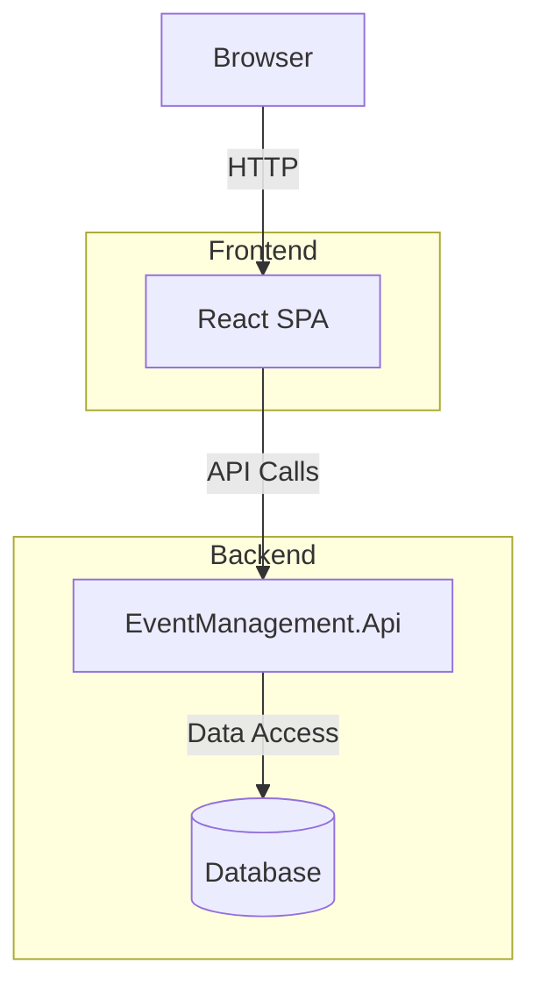

# React SPA Migration Plan

## Objective

The goal is to modernize the `EventRegistrationSystem` application, written in:
* .NET Framework 4.8 and uses 
* ASP.NET MVC (cshtml views, layout, and partials)
* Bootstrap
* Jquery

The new application, `event-management-spa`, a React+Vite application will be the new front-end. It will use the `EventManagement.Api` (.NET 9.0 Minimal API) as the `backend for frontend` (BFF) for any "backend needs"

## Notes
1. Keep the migration plan up to date in `docs\spa-migration.md`
2. Track migration progress in `docs\spa-migration-tasks.md`

## Migration Strategy

### 1. Architecture Overview

### 2. API Integration

The React SPA will communicate with the existing .NET 9.0 API using the OpenAPI specification (`openAPI-v1.json`). We'll use code generation tools to create type-safe API clients:

- Generate TypeScript interfaces from the OpenAPI spec
- Create API client with Axios
- Implement JWT authentication with Authorization header
- Use React Query for data fetching, caching, and state management

### 3. Feature Migration Approach

We'll prioritize GET operations first as they tend to be less complex:

1. **Phase 1**: Core infrastructure setup (project structure, dependencies, API client)
2. **Phase 2**: Implement GET operations (event listings, details, user-specific views)
3. **Phase 3**: Add POST/PUT/DELETE operations (create, edit, delete events, registrations)
4. **Phase 4**: Implement authentication features
5. **Phase 5**: Testing, refinement, and deployment

### 4. Component Structure

The React SPA will be organized into the following component structure:

- **Layout Components**: Header, Footer, Navigation
- **Page Components**: Home, EventList, EventDetails, etc.
- **Feature Components**: EventCard, EventForm, RegistrationForm
- **Common Components**: Button, Input, Modal, etc.

### 5. Authentication & Authorization

Authentication will be handled via JWT (JSON Web Tokens):
- Tokens will be issued by the API upon successful login
- Tokens will contain user ID, email, and roles as claims
- Tokens will be included in the Authorization header for API requests

We'll implement:
- Login/Register forms
- AuthContext for global auth state and token management
- Token storage in localStorage/sessionStorage with proper security measures
- Automatic token refresh mechanism
- Protected routes based on user roles
- Conditional rendering based on user roles

### 6. UI/UX Approach

- Use Bootstrap for styling to maintain visual consistency with the legacy app
- Implement responsive design for all components
- Add loading states and error handling for API operations
- Enhance user experience with client-side validation and feedback

### 7. Testing Strategy

- Unit tests for utility functions and hooks
- Component tests for UI components
- Integration tests for key user flows
- Mock API responses using MSW (Mock Service Worker)

## Implementation Plan

Detailed implementation tasks are tracked in `docs\spa-migration-tasks.md`. The high-level approach is:

1. Set up project infrastructure and dependencies
2. Generate API client from OpenAPI spec
3. Implement core layout and navigation
4. Build out GET operation components first
5. Add authentication and authorization
6. Implement POST/PUT/DELETE operations
7. Refine, test, and deploy

## Technical Stack

- **Framework**: React 19 with TypeScript
- **Build Tool**: Vite
- **Routing**: React Router
- **API Client**: Axios with OpenAPI code generation
- **State Management**: React Query for server state, React Context for app state
- **Forms**: React Hook Form with Zod validation
- **UI Components**: React Bootstrap
- **Testing**: Vitest, React Testing Library, MSW
